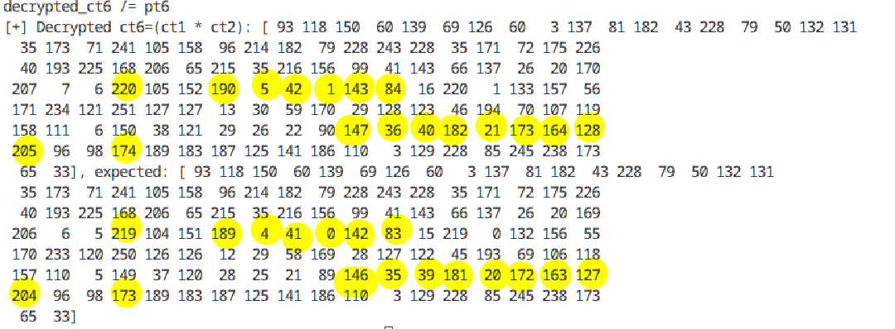
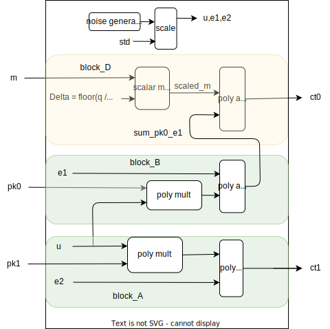

# Python code

The code doesn't seem to always work. Either there is an algorithmic/parameters setting problem or the python code is overflow/underflowing sometimes. Interestingly, the values are close enough and approximately correct. Thus pointing to numerical precision errors.

<figure style="text-align: center;">
  
  <figcaption>Decryption error</figcaption>
</figure>

found the error: code was suppose to be :     
```
    cst1, cst2, pt1, pt2 = (rlwe_updated.gen_uniform_poly(n, t).tolist() for i in range(4))
and not 
    cst1, cst2, pt1, pt2 = (rlwe_updated.gen_uniform_poly(2**16, t).tolist() for i in range(4))

```
but this also points to an interesting observation. why should super long plain text cause rounding issues?


# Encryption

For every message(m) one has to calculate: 
$$
c_t = \left( \left[ (pk0 \cdot u + e_1 + \Delta \cdot m) \right]_{R_q} , \left[ (pk1 \cdot u + e_2) \right]_{R_q}  \in {R_q}\times {R_q} \right)
$$


# High level architecture
A high level system diagram for encryption is as shown here

<figure style="text-align: center;">
  
  <figcaption>Dataflow model</figcaption>
</figure>

## Design specifications:

The plaintexts **m** come from a flow. We assume that the interface is an **AXI stream**.
The resulting ciphertexts **ct=[ct1,ct0]** are sent out to a flow. We assume that the interface is an **AXI stream**.

All the encryptions use the same unique public key **pk=[pk1,pk0]**. 
The computation of this latter is done once on the host CPU.
The implemented parameter set is static. 
This can be one of A or B. Parameter set C is only used for part 2.


|Parameter set         |         |           |       |
|----------------------|---------|-----------|-------|
|                      |A        |B          |   C   |
| polynomial size      | 128     | 16384     | 16    |
|polynomial modulo     | X^128+1 | X^16384+1 | X^16+1|
|ciphertext modulo : q | 2^32    |2^512      | 2^64  |
|plaintext modulo : t  |2^8      | 2^64      | 2^16  |


### Challenge
 - The analysis will be done on 2 parameter sets: A and B
 - If assumptions are needed, feel free to define them.
 - Give an architecture of the design.
 - Describe your approach to the problem.
 - Give the strengths and the weaknesses of the chosen architecture.
 - Give the throughput and an estimation of the latency.
    - If possible give an estimation of the reachable clock frequency.

We want to optimize the **throughput** and the **latency**.

The target FPGA is a Xilinx Ultrascale+ technology on U55C Alveo card.


## Analysis
From the given use case, we know public key tuple [pk1, pk0] is pre-computed at the host once at the beginning and is used all encryptions.

for every **m**,
- sample: r1,r2: normal distribution in R
          u : binary, uniform distribution sample from R
- block_A operation is independent of block_B and Block_D, provided **u** is saved for use in block_B
- 


Design goals: 
   
  - optimizing for throughput and the latency.

From the diagram alone, we can already see some pipelining of operations:

Block_A : independent of incoming data M

